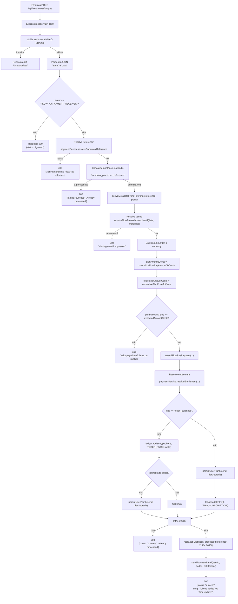

# Payment_Diagram.md

```mermaid
flowchart TD

  A["FP envia POST '/api/webhooks/flowpay'"] --> B["Express recebe 'raw' body"]
  B --> C["Valida assinatura HMAC-SHA256"]
  C -->|inválida| Z["Resposta 401 'Unauthorized'"]
  C -->|válida| D["Parse do JSON\n'event' e 'data'"]

  D --> E{"event == 'FLOWPAY:PAYMENT_RECEIVED'?"}
  E -->|não| E0["Resposta 200\n{status: 'ignored'}"]
  E -->|sim| F["Resolve 'reference'\n paymentService.resolveCanonicalReference"]

  F -->|falha| F0["400\nMissing canonical FlowPay reference"]
  F -->|ok| G["Checa idempotência no Redis\n 'webhook_processed:reference'"]

  G -->|já processado| G0["200\n{status: 'success', 'Already processed'}"]
  G -->|primeira vez| H["deriveMetadataFromReference(reference, plans)"]

  H --> I["Resolve userId\nresolveFlowPayWebhookUserId(data, metadata)"]
  I -->|sem userId| I0["Erro\n'Missing userId in payload'"]

  I -->|ok| J["Calcula amountBrl & currency"]
  J --> K["paidAmountCents = normalizeFlowPayAmountToCents"]
  K --> L["expectedAmountCents = normalizePlanPriceToCents"]

  L --> M{"paidAmountCents >= expectedAmountCents?"}
  M -->|não| M0["Erro\n'Valor pago insuficiente ou inválido'"]
  M -->|sim| N["recordFlowPayPayment(...)"]

  N --> O["Resolve entitlement\n paymentService.resolveEntitlement(...)"]
  O --> P{"kind == 'token_purchase'?"}

  P -->|sim| P1["ledger.addEntry(+tokens, 'TOKEN_PURCHASE')"]
  P1 --> P2{"tierUpgrade existe?"}
  P2 -->|sim| P3["persistUserPlan(userId, tierUpgrade)"]
  P2 -->|não| Q["Continua"]

  P -->|não| R["persistUserPlan(userId, tierUpgrade)"]
  R --> S["ledger.addEntry(0, 'PRO_SUBSCRIPTION')"]

  P3 --> T["entry criado?"]
  Q --> T
  S --> T

  T -->|não| T0["200\n{status: 'success', 'Already processed'}"]
  T -->|sim| U["redis.set('webhook_processed:reference', '1', EX 86400)"]

  U --> V["sendPaymentEmail(userId, dados, entitlement)"]
  V --> W["200\n{status: 'success',\nmsg: 'Tokens added' ou 'Tier updated'}"]
```
