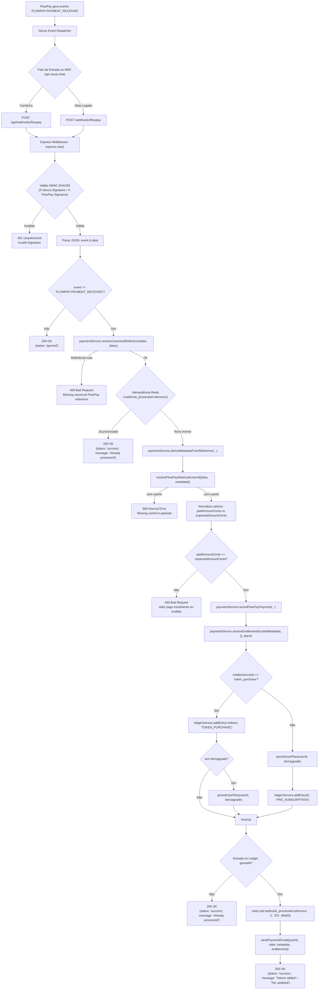

<!-- markdownlint-disable MD003 MD007 MD013 MD022 MD023 MD025 MD029 MD032 MD033 MD034 -->
# Diagrama e Especificação do Fluxo de Pagamento (NØX · FlowPay / Nexus)

```text
========================================
    NØX · PAYMENT ENGINE SPECIFICATION
========================================
Status: active
Gateway: FlowPay (https://api.flowpay.cash)
Bus: Nexus Event Dispatcher
Endpoints: /api/webhooks/flowpay (Canônico)
           /webhooks/flowpay (Alias Nexus)
========================================
```

---

## 1. Visão Geral da Arquitetura Modular

No ecossistema NØX, o faturamento e a recarga de créditos operam de forma determinística entre quatro camadas:

1. **Frontend (`frontend/src/pages/upgrade.astro`):** O usuário seleciona um pacote de créditos (`shared/plans.json`) e inicia a cobrança PIX.
2. **Nginx WAF (`nginx/nginx.conf`):** O escudo de borda em `https://api.noxai.chat` recebe a requisição do webhook e repassa o tráfego para a rede interna em `http://backend.railway.internal:3001`.
3. **Barramento Nexus:** Recebe a notificação de pagamento da FlowPay (`FLOWPAY:PAYMENT_RECEIVED`) e executa o fan-out assinado via HMAC-SHA256 para a API NØX.
4. **Backend Express (`backend/src/server.js`):** Valida a assinatura de segurança, executa deduplicação no Redis, registra a transação no Postgres HA, atualiza o Ledger e dispara o e-mail de confirmação via Resend API.

---

## 2. Contrato de Entrada e Assinatura

### Paths Aceitos
- `POST /api/webhooks/flowpay` *(Handler Canônico)*
- `POST /webhooks/flowpay` *(Alias de compatibilidade para assinatura do Nexus)*

### Inscrição de Evento no Nexus (`config/ecosystem.json`)

```json
{
  "event": "FLOWPAY:PAYMENT_RECEIVED",
  "target": {
    "kind": "webhook",
    "url": "https://api.noxai.chat/api/webhooks/flowpay"
  },
  "secretEnv": "FLOWPAY_WEBHOOK_SECRET"
}
```

### Validação HMAC-SHA256
- O middleware captura o corpo bruto (`express.raw()`).
- O cabeçalho `X-Nexus-Signature` ou `X-FlowPay-Signature` é comparado usando `crypto.timingSafeEqual` com a digest calculada a partir de `FLOWPAY_WEBHOOK_SECRET`.

---

## 3. Diagrama do Fluxo de Execução (Mermaid)



---

## 4. Garantias de Produção & Resiliência

1. **Deduplicação de Camada Dupla:**
   - **Camada 1 (Redis):** Chave com TTL de 24 horas (`webhook_processed:<reference>`).
   - **Camada 2 (Ledger):** Restrição de unicidade na tabela de entradas do Ledger do Postgres HA.
2. **Integridade Financeira (Centavos):** Preços e valores recebidos são convertidos e validados estritamente em centavos inteiros (`normalizeFlowPayAmountToCents`), impedindo divergências de arredondamento em ponto flutuante.
3. **Isolamento do Gateway:** O provedor externo permanece invisível ao usuário final. Todo o saldo é creditado nativamente no **Ledger auditável NØX**.
