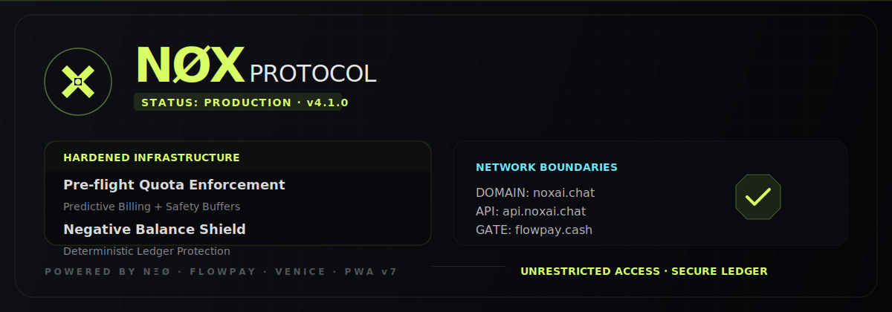

<!-- markdownlint-disable MD003 MD007 MD013 MD022 MD023 MD025 MD029 MD032 MD033 MD034 -->
# NØX



```text
========================================
          NØX · CHAT PROTOCOL
========================================
Status: production
Runtime: Astro SSR + Express API
Domains: noxai.chat / api.noxai.chat
========================================
```

> **Version:** v4.1.0
> **Status:** active
> **Protocol:** NΞØ / FlowPay / Venice

## ⟠ Objetivo

NØX é uma interface mobile-first para acesso a uma LLM
via identidade própria, ledger de uso e checkout FlowPay.

O projeto não vende "um chat genérico".
Ele empacota acesso, experiência, cobrança e auditabilidade
em um front com marca própria.

────────────────────────────────────────

## ⧉ Contrato Atual

```text
┏━━━━━━━━━━━━━━━━━━━━┳━━━━━━━━━━━━━━━━━━━━━━━━━━━━━━━━━━━━
┃ CAMADA             ┃ CONTRATO
┣━━━━━━━━━━━━━━━━━━━━╋━━━━━━━━━━━━━━━━━━━━━━━━━━━━━━━━━━━━
┃ Frontend           ┃ Astro 6 SSR, adapter Node standalone
┃ Backend            ┃ Express API, Venice proxy, auth e ledger
┃ Domínio app        ┃ https://noxai.chat
┃ Domínio API        ┃ https://api.noxai.chat
┃ Pagamentos         ┃ FlowPay em https://api.flowpay.cash
┃ E-mail             ┃ Resend, NØX <send@noxai.chat>
┃ Planos             ┃ shared/plans.json
┗━━━━━━━━━━━━━━━━━━━━┻━━━━━━━━━━━━━━━━━━━━━━━━━━━━━━━━━━━━
```

Guest Mode continua existindo como degustação controlada.
Ele não é exibido como plano gratuito em `/upgrade`.

`/upgrade` mostra apenas pacotes pagos e produtos P.R.O.

────────────────────────────────────────

## ⨷ Componentes

- `src/pages/`: rotas Astro SSR.
- `src/components/AstroChatInterface.astro`: terminal principal.
- `backend/src/server.js`: API Express, auth, chat, FlowPay e webhooks.
- `backend/src/services/ledger.js`: ledger de créditos e consumo.
- `backend/src/services/flowpay.js`: cliente seguro da API FlowPay.
- `backend/src/services/email.js`: envio HTTP via Resend.
- `shared/plans.json`: fonte de verdade de planos, tokens e preços.
- `shared/runtime-prompt.md`: contrato mínimo injetado no runtime.

────────────────────────────────────────

## ⍟ Runtime Boundary

Arquivos operacionais para agentes de desenvolvimento:

- `AGENTS.md`
- `CONTEXT.md`
- `MEMORY.md`
- `SKILL.md`
- `SETUP.md`
- `USER_JOURNEY.md`
- `NEXTSTEPS.md`
- `docs/`
- `.github/prompts/*`

Esses arquivos não são prompt runtime do usuário final.
O runtime do chat usa apenas `shared/runtime-prompt.md`
e os manifestos autorizados em `src/content/manifests/`.

────────────────────────────────────────

## ◬ PNPM Compartilhado

Este repositório usa `pnpm`.
Há `pnpm-workspace.yaml` local e `pnpm-lock.yaml` versionado.

Não trocar para `npm` ou `yarn`.
Não duplicar dependências fora do contrato do workspace.

────────────────────────────────────────

## ⧖ Comandos

```bash
make install
make dev
make check
make build
```

```bash
fnm exec --using v25.9.0 pnpm check
fnm exec --using v25.9.0 pnpm build
fnm exec --using v25.9.0 pnpm --filter chat-api-backend test
```

────────────────────────────────────────

## ◮ Deploy

Frontend Railway:

```text
Start: node dist/server/entry.mjs
Health: /health
PUBLIC_API_URL=https://api.noxai.chat
```

Backend Railway:

```text
Start: node src/server.js
Health: /health
FRONTEND_URL=https://noxai.chat
FLOWPAY_API_URL=https://api.flowpay.cash
RESEND_FROM_EMAIL=NØX <send@noxai.chat>
```

`FLOWPAY_API_URL` nunca deve apontar para `api.noxai.chat`.
Esse domínio é da API NØX, não do provedor FlowPay.

────────────────────────────────────────

## ⧇ Documentação

- [Setup](./SETUP.md)
- [Jornada do usuário](./USER_JOURNEY.md)
- [Próximos passos](./NEXTSTEPS.md)
- [Markdown Style Guide](./docs/MARKDOWN_STYLE_GUIDE.md)

```text
▓▓▓ NØX
────────────────────────────────────────
Mobile-first AI access with ledgered usage.
────────────────────────────────────────
```
