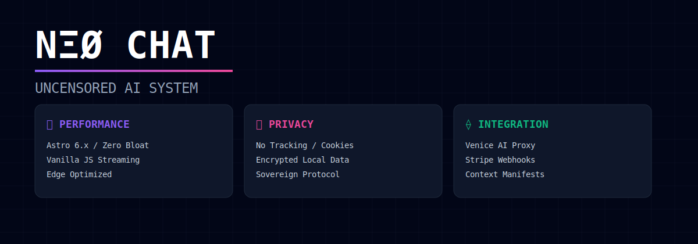

<!-- markdownlint-disable MD003 MD007 MD013 MD022 MD023 MD025 MD029 MD032 MD033 MD034 -->

```text
========================================
     NEØ CHAT · UNCENSORED SYSTEM
========================================
```



> **Version:** v1.1.0  
> **Status:** observed  
> **Framework:** Astro 6.x  
> **Stack:** Vanilla JS / SSE / Tailwind

## ⟠ Objetivo

Interface soberana para interação com modelos de IA sem censura via NΞØ Protocol.
Foco em performance extrema, privacidade total e zero dependências desnecessárias.

O sistema foi migrado de um monólito React/Next.js para uma arquitetura Astro nativa,
garantindo tempo de resposta instantâneo e integridade de contexto.

────────────────────────────────────────

## ⧉ Arquitetura

O ecossistema é dividido em dois núcleos funcionais operando sob o mesmo plano de controle.

```text
▓▓▓ SYSTEM TOPOLOGY
────────────────────────────────────────
└─ Root (Astro 6.x)
   ├─ src/pages/ (Static Routes)
   ├─ src/components/ (Astro/Vanilla Components)
   └─ public/ (Static Assets & Logo)

└─ Backend (Express/Node.js)
   ├─ src/server.js (Core Logic)
   └─ .env (Sensitive Context)
────────────────────────────────────────
```

### 1. Frontend (Astro)

Componentização baseada em Astro e scripts Vanilla JS.
Utiliza Server-Sent Events (SSE) para streaming de tokens em tempo real.
Design System: Glassmorphism / Cyberpunk (Tailwind CSS puro).

### 2. Backend (Proxy)

Gateway seguro para a Venice AI API.
Gerenciamento de rate limiting, quotas diárias e integração com Stripe.
Bypass de autenticação em modo desenvolvimento para agilidade operacional.

────────────────────────────────────────

## ⨷ Comandos

Todos os comandos devem ser executados via `pnpm` para garantir consistência do lockfile.

```bash
# Inicializar ambiente e dependências
make install

# Iniciar ecossistema completo (FE + BE)
make dev

# Auditoria de segurança e integridade
make audit
make verify

# Build de produção
make build
```

────────────────────────────────────────

## ⍟ Segurança

- **Zero Bloat**: Removido Framer Motion, Zustand e React-Three-Fiber.
- **Privacy First**: Chaves de API nunca tocam o cliente; processamento via proxy.
- **Context Engineering**: Manifestos de integridade em `neo-ai/manifests/`.

────────────────────────────────────────

```text
▓▓▓ NΞØ MELLØ
────────────────────────────────────────
Core Architect · NΞØ Protocol
neo@neoprotocol.space

"Code is law. Expand until
chaos becomes protocol."

Security by design.
Exploits find no refuge here.
────────────────────────────────────────
```
