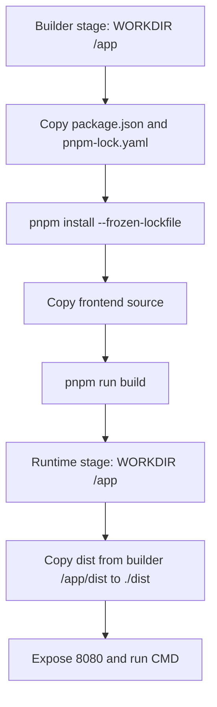

# Frontend Docker Build Flowchart

```mermaid
flowchart TD
    A[Builder stage: WORKDIR /app] --> B[Copy package.json and pnpm-lock.yaml]
    B --> C[pnpm install --frozen-lockfile]
    C --> D[Copy frontend source]
    D --> E[pnpm run build]
    E --> F[Runtime stage: WORKDIR /app]
    F --> G[Copy dist from builder /app/dist to ./dist]
    G --> H[Expose 8080 and run CMD]
```
